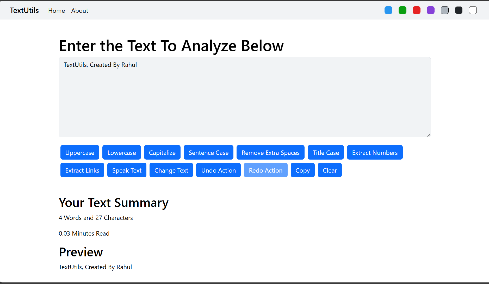
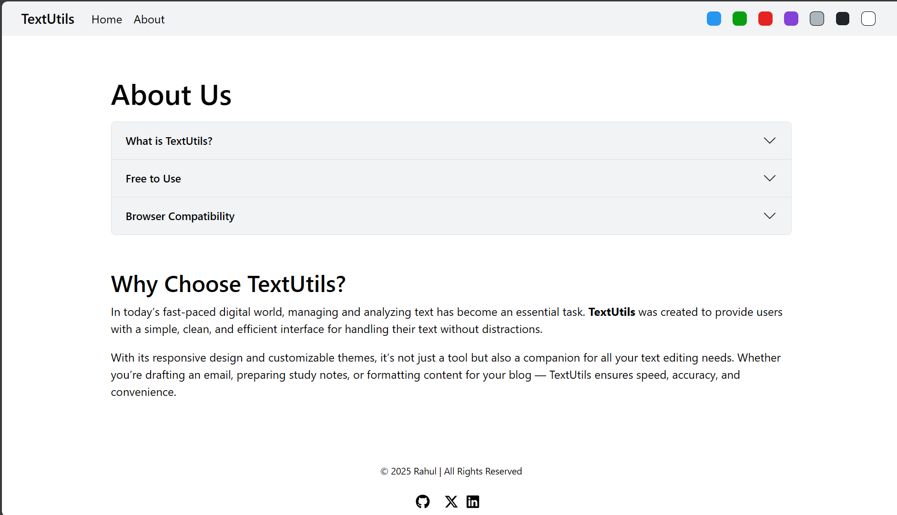

# 📘 TextUtils

A simple React-based text utility app that helps you analyze and manipulate your text efficiently.

---

## 🚀 Features

### ✨ Text Manipulation
- 🔠 **Uppercase** – Convert text to UPPERCASE  
- 🔡 **Lowercase** – Convert text to lowercase  
- 🔤 **Capitalize** – Capitalize each word  
- 📝 **Sentence Case** – Convert text into sentence case  
- 📑 **Title Case** – Convert text into title-style formatting  
- ➖ **Remove Extra Spaces** – Clean unnecessary spaces  

### 🔍 Extraction
- 🔢 **Extract Numbers** – Extract only numbers from text  
- 🔗 **Extract Links** – Extract only links (URLs) from text  

### 🎙 Audio
- 🔊 **Speak Text** – Read the entered text aloud (Text-to-Speech)  

### ✏ Editing
- 🔄 **Change Text** – Replace selected text with new text  
- ↩ **Undo** – Undo last change  
- ↪ **Redo** – Redo last undone change  
- 📋 **Copy** – Copy text to clipboard  
- ❌ **Clear** – Clear the textbox  

### 📊 Text Summary
- 📝 **Word Count**  
- 📝 **Character Count**  
- ⏱ **Estimated Reading Time**  
- 👀 **Live Preview** of entered text  

---

## 🛠️ Tech Stack
- React.js (with Hooks)  
- React Router v6  
- JavaScript (ES6+)  
- HTML5 & CSS3  

---

## 📸 Screenshots

### 🏠 Home Page


### ℹ️ About Page


---

## 📂 Project Structure

```plaintext
TextUtils/
├── public/
│   ├── favicon.ico
│   ├── index.html
│   └── ...
├── src/
│   ├── components/
│   │   ├── Navbar.js
│   │   ├── TextForm.js
│   │   └── About.js
│   ├── App.js
│   ├── index.js
│   └── App.css
├── package.json
└── README.md


---

## 📜 License
This project is licensed under the **MIT License** – feel free to use and modify.  

